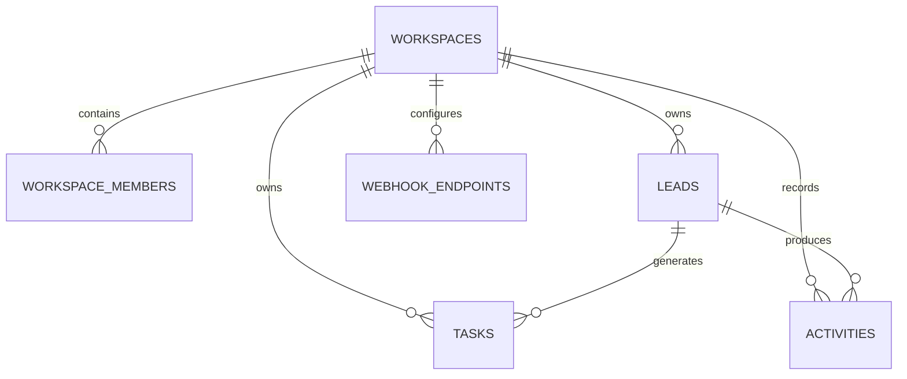

# Data model

## Tenant boundary
Every business object carries `workspace_id`. PostgreSQL Row Level Security is the primary tenant isolation boundary. The app layer must still scope all reads/writes explicitly for defense in depth.

## Authorization model
- `admin`: workspace settings, integrations, members, all lead operations.
- `manager`: lead/task operations and reporting.
- `member`: read access plus task/lead creation; destructive permissions remain restricted.

## Auditability
Business-relevant mutations emit append-only activity records. Secret values are never stored in activity payloads.
